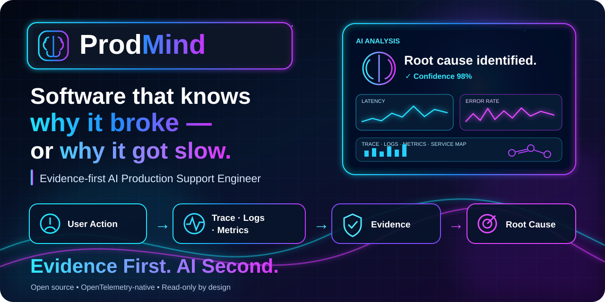

# ProdMind

> **Software that knows why it broke — or why it got slow.**

[](https://github.com/kakaluote155/ProdMind/actions/workflows/ci.yml)

[](LICENSE)


**ProdMind is an open-source, embeddable AI Production Support Engineer for software already running in production.**

<p align="center">
  
</p>

Instead of asking a customer to collect screenshots, logs and a Trace ID, ProdMind starts from the user's exact action, correlates it with production telemetry, evaluates deterministic RCA rules, and returns two deliberately different views:

- **Customer:** a safe explanation of what happened.
- **Engineer:** the technical root cause, supporting evidence, service topology, recent change context and optional AI investigation.

**Current version: `v1.0.0`.** ProdMind is read-only by design: it investigates and recommends; it does not mutate production.

## See it work

A customer triggers a real failure in the Docker demo and asks ProdMind why it happened. The customer never has to find or enter a Trace ID.


```text
Customer action
      ↓
W3C Trace Context + Project
      ↓
Tempo + Loki + Prometheus
      ↓
Normalized Evidence
      ↓
Deterministic RCA
      ↓
Root Cause
   ↙        ↘
Customer    Engineer
answer      Evidence Graph
                ↓ optional
          AI Investigator
```

## Why ProdMind?

| Typical production-support workflow | ProdMind |
| --- | --- |
| Start from an alert or a pile of logs | Start from the **user action that actually failed or became slow** |
| Ask an LLM to infer a cause from unstructured text | Build **normalized evidence first**, then run deterministic RCA |
| One technical answer for everyone | Separate **customer-safe** and **engineer** responses |
| Treat a recent deployment as suspicious by default | Keep changes as **context, not causation** |
| Historical similarity can bias the diagnosis | Incident Memory supports the investigation **only after current evidence establishes RCA** |
| AI may hallucinate missing facts | AI claims must cite supplied **Evidence IDs** and cannot replace the authoritative root cause |
| Automation may be allowed to touch production | `v1.0` is **read-only** |

> **Evidence First, AI Second.** ProdMind does not dump random logs into an LLM and ask it to guess.

## Try it in minutes

Requirements: Docker with Compose support.

### Linux / macOS

```bash
git clone https://github.com/kakaluote155/ProdMind.git
cd ProdMind
bash scripts/demo-up.sh
```

### Windows PowerShell

```powershell
git clone https://github.com/kakaluote155/ProdMind.git
cd ProdMind
.\scripts\demo-up.ps1
```

The launcher builds the stack, waits for readiness and prints the URLs.

**Customer demo**

```text
http://localhost:8090
```

**Engineer Evidence Graph**

```text
http://localhost:8088/engineer
```

**API docs**

```text
http://localhost:8088/docs
```

Demo engineer credentials:

```text
Project: demo
Engineer key: demo-engineer-key
```

Stop while preserving local data:

```bash
bash scripts/demo-down.sh
```

PowerShell:

```powershell
.\scripts\demo-down.ps1
```

Use `--volumes` on Bash or `-Volumes` on PowerShell to reset local demo data.

## What it can diagnose today

The repository includes real end-to-end scenarios rather than mocked RCA responses.

| Scenario | Evidence | RCA |
| --- | --- | --- |
| Duplicate user | PostgreSQL unique violation / exception evidence | `database_unique_violation` |
| Downstream dependency unavailable | Verified connection failure | `downstream_unavailable` |
| Database pool exhausted | Connection acquisition timeout **plus** Prometheus pool saturation | `database_pool_exhausted` |
| Successful but slow DB request | HTTP 200 **plus** dominant DB span in the trace | `slow_database_query` |
| Successful but slow downstream service | Verified caller → callee span relationship **plus** dominant downstream latency | `slow_downstream_service` |

If the evidence is not strong enough, ProdMind returns `insufficient_evidence` instead of manufacturing a diagnosis.

## How it works

### 1. Capture the user action

The browser SDK creates or preserves W3C trace context before the request leaves the page and remembers only the minimum action context needed for correlation.

```text
create-user
    ↓
traceparent + request ID
    ↓
real application request
```

Request bodies, passwords, tokens and arbitrary headers are not copied into ProdMind action state.

### 2. Collect production telemetry

ProdMind uses standard observability systems:

```text
Trace   → Grafana Tempo
Logs    → Grafana Loki
Metrics → Prometheus
```

OpenTelemetry propagates trace context through instrumented services. Every participating service is scoped with:

```text
prodmind.project.id=<project-id>
```

Traces with missing or conflicting project identities fail closed.

### 3. Normalize vendor data into evidence

Raw observability payloads are converted into vendor-neutral facts such as:

```text
SpanSample
MetricSample
ServiceCallSample
Evidence
ServiceTopology
```

For example, raw span IDs may be used inside the Tempo adapter to verify a distributed parent/child relationship, but RCA receives only the normalized caller, callee, operation and duration.

### 4. Run deterministic RCA

The rule registry currently includes:

```text
DatabasePoolExhaustedRule
DatabaseUniqueViolationRule
DownstreamUnavailableRule
SlowDownstreamServiceRule
SlowDatabaseQueryRule
```

Rules can combine multiple evidence sources. A database connection timeout alone, for example, is not enough to diagnose pool exhaustion; project/service-scoped Prometheus metrics must confirm saturation.

### 5. Produce different answers for different audiences

A diagnosed incident becomes two separate API shapes.

**Customer view** excludes internal service names, raw logs, stack traces, Trace IDs, SQL, internal hosts, capacity metrics, change details and engineer remediation notes.

**Engineer view** can include the Evidence Graph, service topology, normalized technical evidence, Incident Memory and recent change context after authentication.

## Evidence Graph

The engineer view shows **why** a diagnosis was assigned.

```text
generate-report
      ↓
Distributed trace
      ├──contains──▶ Service A
      └──contains──▶ Service B

Service A ──calls──▶ Service B
                         ↓
                    slow operation
                         ↓
Critical evidence ──supports──▶ slow_downstream_service
```

Topology and causality stay separate:

- `calls` explains **where work flowed**.
- `supports` explains **which evidence supports RCA**.
- `context_for` attaches a recent deployment/config change without claiming it caused the incident.
- `similar_to` attaches historical incidents without replacing current evidence.

The graph explains a diagnosis; it does not create one.

## Optional AI Investigator

ProdMind can add a grounded AI layer after deterministic investigation:

```text
Project-authorized telemetry
        ↓
Deterministic RCA
        ↓
Minimized evidence packet
        ↓
AI Investigator
```

Engineer-only endpoint:

```text
POST /api/v1/investigator/trace
```

The AI layer is disabled by default. When enabled, it may:

- explain the verified root cause;
- summarize supporting evidence;
- answer follow-up questions within the same project/trace session;
- identify missing evidence;
- recommend read-only investigation steps.

It may **not** replace deterministic `root_cause`, invent telemetry, run shell commands, restart services, change databases, deploy code or perform remediation.

Provider abstraction currently ships with:

```text
disabled
openai (Responses API)
```

See [`docs/ai-investigator.md`](docs/ai-investigator.md).

## Integrate ProdMind into another application

Current supported integration paths:

| Application | Integration |
| --- | --- |
| Browser / Vue / React / Web | `@prodmind/widget` |
| Spring Boot | `prodmind-spring-boot-starter` |
| Python / ASGI | `prodmind-integration` |
| Other OpenTelemetry systems | Configure trace propagation and `prodmind.project.id` manually |

Spring Boot example:

```xml
<dependency>
  <groupId>io.prodmind</groupId>
  <artifactId>prodmind-spring-boot-starter</artifactId>
  <version>1.0.0</version>
</dependency>
```

```yaml
prodmind:
  project-id: customer-portal
```

Resource-level OpenTelemetry configuration remains the preferred universal path:

```text
OTEL_RESOURCE_ATTRIBUTES=prodmind.project.id=customer-portal
```

See [`integrations/README.md`](integrations/README.md).

## Architecture

```text
Customer / User
      ↓
ProdMind Widget / SDK
      ↓
W3C Trace Context + Project
      ↓
┌──────────────────────────────────────┐
│            ProdMind Server           │
│                                      │
│  Project Scope Validation            │
│              ↓                       │
│  Telemetry Connectors                │
│  Tempo / Loki / Prometheus           │
│              ↓                       │
│  Normalized Evidence + Topology      │
│              ↓                       │
│  RCA Rule Registry                   │
│              ↓                       │
│  Authoritative Root Cause            │
│        ↙              ↘              │
│ Customer Policy      Evidence Graph  │
│                           │          │
│             Incident Memory / Change │
│                           │          │
│                 optional AI          │
└──────────────────────────────────────┘
```

Core server stack:

```text
Python 3.12
FastAPI
Pydantic
httpx
pytest
```

Demo / integration stack includes OpenTelemetry, Tempo, Loki, Prometheus, Spring Boot, Java 21, PostgreSQL and Docker Compose.

## Security boundaries

ProdMind `v1.0` is designed to fail closed around engineer evidence and project isolation.

- Every investigation requires a valid project scope.
- Production engineer APIs use project-bound credentials.
- Customer and engineer response models are separate on the server, not merely hidden in the UI.
- Tempo/Loki/Prometheus connectors support bounded responses, timeouts, TLS/custom CA and bearer tokens.
- Incident Memory and Change Store use project-scoped retention limits.
- External AI context excludes raw logs, Trace IDs, request bodies, credentials, Change details and Incident Memory details by default.
- Automatic remediation remains outside `v1.0`.

See [`SECURITY.md`](SECURITY.md) and [`docs/production-deployment.md`](docs/production-deployment.md).

## Documentation

- [`docs/quickstart.md`](docs/quickstart.md) — get the demo running
- [`demo/README.md`](demo/README.md) — reproducible fault scenarios
- [`docs/architecture.md`](docs/architecture.md) — architecture and safety boundaries
- [`docs/evidence-graph.md`](docs/evidence-graph.md) — Evidence Graph design
- [`docs/critical-path.md`](docs/critical-path.md) — distributed critical-path RCA
- [`docs/metrics.md`](docs/metrics.md) — normalized metrics and Prometheus strategy
- [`docs/trace-latency.md`](docs/trace-latency.md) — slow successful operations
- [`docs/incident-memory.md`](docs/incident-memory.md) — operational memory
- [`docs/change-awareness.md`](docs/change-awareness.md) — deployment/configuration context
- [`docs/ai-investigator.md`](docs/ai-investigator.md) — grounded AI contract
- [`docs/api-compatibility.md`](docs/api-compatibility.md) — frozen v1 API policy
- [`docs/production-deployment.md`](docs/production-deployment.md) — production deployment and rollback
- [`docs/release.md`](docs/release.md) — release process and artifacts
- [`integrations/README.md`](integrations/README.md) — application integration

## Status and roadmap

✅ **v1.0 core complete**

```text
User Action → Investigate → Evidence → Root Cause → Explain → Recommend
```

Future work focuses on broader production connectors and integrations, richer distributed topology/critical-path reasoning, and eventually **human-approved** remediation with explicit auditing, verification and rollback.

Possible future connectors include Docker, PostgreSQL/MySQL, Redis, Nginx, Kafka and Kubernetes.

See [`docs/roadmap.md`](docs/roadmap.md) for the detailed roadmap.

## What ProdMind is not

ProdMind is **not another chatbot for your logs**.

It is an attempt to build software that can explain its own production failures and performance problems using real evidence — without pretending that a recent deployment, a similar historical incident or an LLM guess is automatically the root cause.

## Contributing

Issues, design discussions and pull requests are welcome. See [`CONTRIBUTING.md`](CONTRIBUTING.md).

If ProdMind solves a production-support problem you care about, a ⭐ helps other engineers discover the project.

## License

MIT
