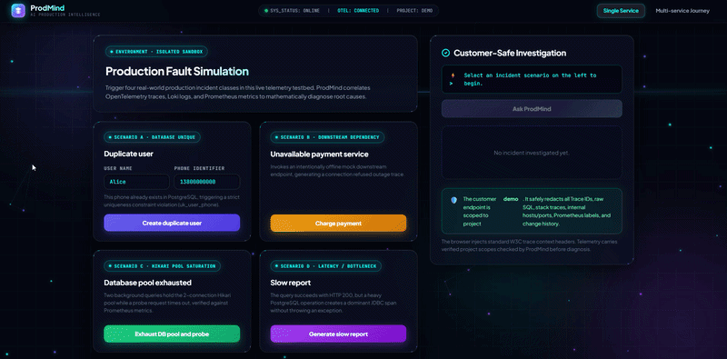

# ProdMind

> **Software that knows why it broke — or why it got slow.**

ProdMind is an open-source, embeddable **AI Production Support Engineer** for software already running in production.

A customer should be able to ask:

> **Why did my last operation fail?**
>
> **Why was my last operation so slow?**

An engineer should also be able to ask:

> **What changed around this incident?**

ProdMind correlates the user's exact action with real production evidence — **traces, logs, metrics, historical incidents and recent changes** — and deliberately produces two separated views:

- a safe explanation for the customer;
- an authenticated technical Evidence Graph for authorized engineers.

## The idea

```text
Customer action
      ↓
W3C Trace Context + Project
      ↓
Project-scoped telemetry
      ↓
Tempo + Loki + Prometheus
      ↓
Normalized Evidence
      ↓
Pluggable RCA Rules
      ↓
Root Cause
   ↙        ↘
Customer    Engineer Evidence Graph
answer      + Incident Memory
            + Change Context
```

## Live demo: four real operational classes

The Docker demo proves three failures **and one successful-but-slow request** end to end.



```text
A. Duplicate user
PostgreSQL unique violation
        ↓
database_unique_violation
        ↓
duplicate_data

B. Payment dependency unavailable
Connection refused
        ↓
downstream_unavailable
        ↓
service_unavailable

C. Database pool exhausted
2 requests hold a 2-connection Hikari pool
        ↓
3rd request times out acquiring a connection
        ↓
Trace/Log + Prometheus active/max/pending
        ↓
database_pool_exhausted
        ↓
service_busy

D. Report succeeds but is slow
HTTP 200 after a real PostgreSQL operation
        ↓
Tempo trace timing + dominant JDBC span
        ↓
slow_database_query
        ↓
slow_operation
```

The customer never receives or enters a Trace ID. The browser creates trace context before the request leaves the page, and OpenTelemetry continues it through the backend.

## Deployment / Change Awareness

Production responders often ask **“what changed?”** immediately after identifying a failure. ProdMind can record compact deployment/configuration metadata and attach relevant recent changes to an engineer investigation.

The key rule is deliberately conservative:

> **Recent change ≠ root cause.**

ProdMind first completes the current RCA using trace/log/metric evidence. Only after a diagnosis exists does it query recent changes for the same project and services.

```text
Current Trace / Logs / Metrics
            ↓
Independent RCA
            ↓
Recent same-project changes
            ↓
Same-service / same-version prioritization
            ↓
Engineer-only context
```

For example:

```text
Deployment demo-v2
      │
      └── context_for ──▶ demo-user-service
                              ↓
                         current trace
                              ↓
                   database_unique_violation
```

The deployment is useful context, but ProdMind does **not** relabel the root cause as `deployment_regression` just because the timestamps are close.

Delivery tooling can record a compact change:

```bash
curl -X POST http://localhost:8088/api/v1/changes \
  -H 'Content-Type: application/json' \
  -H 'X-ProdMind-Project: demo' \
  -H 'X-ProdMind-Engineer-Key: demo-engineer-key' \
  -d '{
    "service_name":"demo-user-service",
    "version":"demo-v2",
    "revision":"abc123",
    "change_type":"deployment",
    "summary":"Deploy demo-v2",
    "actor":"ci",
    "source":"github-actions"
  }'
```

The default Change Store keeps compact metadata only. It does not persist source code, repository diffs or raw CI logs, and common secret assignments are redacted before storage.

## Performance RCA without exceptions

ProdMind does not assume every slow request is a database problem.

`slow_database_query` requires all of the following:

```text
request is not HTTP 5xx
AND trace duration >= 1.5s
AND dominant database span >= 1s
AND database span >= 70% of total trace duration
```

For the demo, a report returns HTTP 200 after a real PostgreSQL operation consumes almost the entire trace. No exception is needed.

Tempo span timestamps are normalized into vendor-neutral `SpanSample` facts. Raw SQL, span IDs and table names are intentionally not copied into the normalized model.

## Metric-corroborated capacity RCA

A connection-acquisition timeout alone does **not** prove the database pool was exhausted. ProdMind refuses to assign `database_pool_exhausted` until the failure is corroborated by recent, project/service-scoped Prometheus metrics:

```text
Connection acquisition timeout
            +
recent db_pool_active >= db_pool_max
            ↓
database_pool_exhausted
```

Prometheus is supporting evidence. If it is unavailable, unrelated Trace/Loki diagnoses continue to work.

## Evidence Graph

Authorized engineers can see **why** a diagnosis was assigned instead of reading a flat evidence list.

A successful slow report can become:

```text
generate-report
      ↓
HTTP 200 / Trace
      ↓
demo-user-service
      ↓
Slow span: database SELECT
      ↓
Dominant database evidence
      ↓
slow_database_query
```

Historical incidents and recent changes appear with deliberately different semantics:

```text
Prior incident ──similar_to──▶ current root cause
Recent change  ──context_for─▶ affected service
```

The graph is deterministic and built only from an existing investigation result. It **explains a diagnosis; it does not create one**.

Engineer graph API:

```text
POST /api/v1/investigate/trace/graph
```

Optional evidence-grounded AI Investigator API:

```text
POST /api/v1/investigator/trace
```

The AI Investigator is engineer-only and disabled by default. It receives a
minimized normalized evidence packet, cannot replace deterministic RCA, has no
remediation tools, and must cite supplied Evidence IDs for every structured
claim. Raw log lines, Trace IDs, Change details and Incident Memory are excluded
from external model context by default.

Required headers:

```text
X-ProdMind-Project: <project-id>
X-ProdMind-Engineer-Key: <engineer-key>
```

All `/api/v1/*` responses declare `X-ProdMind-API-Version: v1`. The reviewed
OpenAPI snapshot and compatibility rules are documented in
[`docs/api-compatibility.md`](docs/api-compatibility.md).

Lightweight viewer:

```text
http://localhost:8088/engineer
```

## Core principles

### Evidence first

ProdMind does not dump random logs into an LLM and ask it to guess. Investigation starts from correlated, normalized evidence.

### Pluggable diagnosis

```text
Tempo / Loki / Prometheus / future connectors
                    ↓
             normalized facts
        MetricSample / SpanSample / ...
                    ↓
               Rule Registry
          ├── database unique
          ├── downstream unavailable
          ├── database pool exhausted
          ├── slow database query
          └── future rules...
                    ↓
             RootCause + Evidence
```

### Project-isolated evidence

Telemetry is tagged with `prodmind.project.id`. Trace investigations require `X-ProdMind-Project`; metric and change lookups are additionally scoped by project and service. Cross-project traces, Incident Memory and Change Events stay isolated.

### Customer-safe by design

Customer APIs do not return:

- Trace IDs or span IDs
- raw SQL or database/table names
- raw logs or stack traces
- internal hosts or ports
- Prometheus metric names/capacity values
- raw engineer timing evidence
- deployment versions/revisions/change summaries
- engineer remediation details
- Evidence Graph nodes/edges
- Incident Memory evidence

### Engineer authentication

Engineer investigation, Evidence Graph and Change ingestion APIs require `X-ProdMind-Engineer-Key`. If engineer authentication is not configured, those APIs fail closed.

### Read-only by default

ProdMind investigates production systems. It does **not** automatically restart services, execute shell commands, change databases or modify production resources.

### Privacy-conscious operational memory

Diagnosed incidents can become project-scoped reusable operational knowledge. The default Incident Memory backend stores compact root-cause/resolution facts rather than copying raw logs, stack traces or request bodies.

The Change Store follows the same philosophy: compact metadata, project isolation and no repository source/diff persistence.

## Current scope

- [x] FastAPI investigation service
- [x] Evidence-first deterministic RCA engine
- [x] Pluggable RCA rule registry
- [x] OpenTelemetry demo instrumentation
- [x] Tempo trace connector
- [x] Loki correlated log connector
- [x] Prometheus metric connector
- [x] Vendor-neutral `MetricSample`
- [x] Vendor-neutral `SpanSample` + trace latency normalization
- [x] Database unique-violation RCA
- [x] Downstream-unavailable RCA
- [x] Prometheus-backed database-pool-exhaustion RCA
- [x] Successful slow-database-operation RCA
- [x] Interactive four-scenario demo
- [x] Automatic browser action → request/trace correlation
- [x] Project-scoped telemetry isolation
- [x] Customer / engineer response isolation
- [x] Engineer API authentication
- [x] Privacy-conscious, project-scoped Incident Memory
- [x] Secure deterministic Evidence Graph API
- [x] Lightweight engineer Evidence Graph viewer
- [x] Project-scoped deployment/configuration Change Store
- [x] Authenticated CI/CD change ingestion API
- [x] Service-version-aware recent change matching
- [x] Non-causal `context_for` change nodes in Evidence Graph
- [x] E2E proof for four real operational classes
- [x] Independent deployment/change-awareness E2E
- [x] Verified cross-service critical-path RCA
- [x] Layered service topology in the engineer Evidence Graph
- [x] Separate service nodes with verified caller → callee `calls` edges
- [x] Service-scoped normalized operation evidence
- [x] Evidence-grounded AI Investigator API foundation
- [x] Fail-closed LLM provider abstraction (`disabled` / OpenAI Responses)
- [x] Project/trace-scoped bounded multi-turn investigator sessions
- [x] Strict Evidence ID citation validation and read-only next-step planning
- [x] Engineer viewer AI follow-up panel
- [x] Deterministic AI safety evaluations and CI quality gates
- [x] Isolated and tested embeddable JavaScript SDK client
- [x] Spring Boot Starter and Python OpenTelemetry integration packages
- [x] Versioned and checksummed release-candidate artifacts
- [x] README demo GIF generated from the real customer-safe Docker demo

## Architecture

```text
Customer / User
      ↓
ProdMind Widget / SDK
      ↓
W3C Trace Context + Project
      ↓
┌────────────────────────────────┐
│          ProdMind Server       │
│                                │
│    Project Scope Validation    │
│             ↓                  │
│    Telemetry Normalization     │
│    spans / logs / metrics      │
│             ↓                  │
│        Evidence Model          │
│             ↓                  │
│       RCA Rule Registry        │
│             ↓                  │
│        Root Cause Engine       │
│          ↙          ↘          │
│   Response Policy  Evidence    │
│         ↓          Graph       │
│   Customer API       ↑         │
│                      │         │
│       ┌──────────────┴──────┐  │
│       │ Incident Memory     │  │
│       │ Change Context      │  │
│       └─────────────────────┘  │
└──────────────┬─────────────────┘
               │
        ┌──────┼────────┐
        ↓      ↓        ↓
      Traces  Logs    Metrics
        ↓      ↓        ↓
      Tempo   Loki  Prometheus
```

## Quick start

```bash
git clone https://github.com/kakaluote155/ProdMind.git
cd ProdMind
bash scripts/demo-up.sh
```

Windows PowerShell:

```powershell
.\scripts\demo-up.ps1
```

Both commands build the stack in the background, wait for the API, demo service
and Prometheus readiness endpoints, then print the customer and engineer URLs.

Customer demo:

```text
http://localhost:8090
```

Try:

1. **Create duplicate user** — PostgreSQL uniqueness violation.
2. **Charge payment** — unreachable dependency.
3. **Exhaust DB pool and probe** — real Hikari saturation + Prometheus evidence.
4. **Generate slow report** — HTTP 200, then ask ProdMind why it was slow.

Engineer graph viewer:

```text
http://localhost:8088/engineer
```

Local demo credentials:

```text
Project: demo
Engineer key: demo-engineer-key
```

API docs:

```text
http://localhost:8088/docs
```

Stop the demo while preserving local data:

```bash
bash scripts/demo-down.sh
```

Add `--volumes` to reset all local demo data. PowerShell uses
`.\scripts\demo-down.ps1` and the `-Volumes` switch.

See:

- [`demo/README.md`](demo/README.md) — reproducible scenarios
- [`docs/incident-memory.md`](docs/incident-memory.md) — operational memory
- [`docs/evidence-graph.md`](docs/evidence-graph.md) — graph design/security
- [`docs/metrics.md`](docs/metrics.md) — normalized metrics/Prometheus strategy
- [`docs/trace-latency.md`](docs/trace-latency.md) — successful-operation latency RCA
- [`docs/critical-path.md`](docs/critical-path.md) — distributed critical-path and layered topology
- [`docs/ai-investigator.md`](docs/ai-investigator.md) — grounded AI/provider/session safety contract
- [`docs/api-compatibility.md`](docs/api-compatibility.md) — v1 schema and compatibility policy
- [`integrations/README.md`](integrations/README.md) — Spring Boot and Python application integration
- [`docs/change-awareness.md`](docs/change-awareness.md) — deployment/configuration context and causality rules

## Roadmap

### v0.1 — Explain failures

User action → evidence → root cause → customer-safe explanation → engineer report.

### v0.2 — Generalize, isolate and remember

Pluggable RCA rules, multiple failure classes, project isolation, engineer authentication and Incident Memory.

### v0.3 — Explain the diagnosis visually

Deterministic Evidence Graph API and authenticated engineer investigation view.

### v0.4 — Add capacity evidence

Prometheus, normalized metrics and metric-corroborated resource/capacity RCA.

### v0.5 — Explain slow successful operations

Trace timing normalization and dominant-span performance RCA without requiring an exception.

### v0.6 — Understand what changed

Project-scoped deployment/configuration events, service-version matching and non-causal change context.

### v0.7 — Diagnose multi-service critical paths

Distributed Trace analysis that reconstructs verified caller → callee relationships and identifies the downstream service hop dominating end-to-end latency.

### v0.8 — Build layered service topology

Represent participating services as separate Evidence Graph nodes, visualize verified service-to-service calls, preserve deeper dependency evidence, and keep topology relationships distinct from RCA causality.

Implemented on `main`: the engineer graph consumes a normalized `ServiceTopology`, renders each participating service separately, connects verified caller → callee hops with `calls`, and attaches slow normalized operations to their owning service without exposing raw span IDs.

### v0.9 — AI investigation and productization

Add an evidence-grounded AI Investigator, LLM provider abstraction, multi-turn investigation planning, improved embeddable JavaScript SDK, Spring Boot Starter / Python integration paths, polished one-command demo, Quick Start, README GIF and release-candidate packaging.

The AI layer must remain subordinate to evidence: it may plan investigations and explain verified facts, but it must not invent telemetry or unsupported root causes.

In progress: the grounded investigator API, provider abstraction, bounded
read-only multi-turn sessions, provider-independent safety evaluations, the
isolated browser SDK, Spring Boot/Python integration packages, polished Quick
Start, release-candidate packaging and the real customer-safe demo GIF are
implemented. The planned v0.9 scope is complete in this release-candidate
worktree; v1.0 hardening remains separate.

### v1.0 — Stable Production Support

A stable, documented and installable release that teams can embed into real applications for evidence-backed production support.

```text
User Action → Investigate → Evidence → Root Cause → Explain → Recommend
```

Target qualities for v1.0 include stable APIs, production-ready integration paths, documented security boundaries, reproducible deployment, core production connectors, and reliable customer/engineer separation.

### Future — Human-approved remediation

Safe remediation comes after ProdMind is trustworthy as an investigator. Execution remains explicitly gated by human approval, auditing, verification and rollback.

```text
Detect → Investigate → Explain → Recommend → Approve → Repair → Verify → Rollback → Learn
```

Possible future connectors and integrations include Docker, PostgreSQL/MySQL, Redis, Git/release systems, Nginx, Kafka and Kubernetes.

## What ProdMind is not

ProdMind is not another chatbot for your logs.

It is an attempt to build **software that can explain its own production failures and performance problems using real evidence, while showing engineers what changed without pretending correlation is causation**.

## Status

🚧 **Early development** — APIs and architecture may change quickly.

## License

MIT
